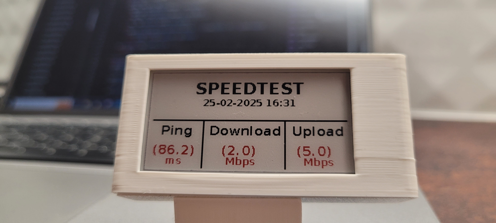

# Raspberry_pi_Waveshare_speedtest

## Raspberry Pi Speed Test Display on Waveshare 2.13 V4 e-Paper Screen

This project runs a speed test using the speedtest-cli tool (https://github.com/sivel/speedtest-cli) and displays the results on a Waveshare 2.13 V4 Black, White, and Red e-Paper screen. The display is connected to a Raspberry Pi Zero 2 W. The display library comes from [this repository]( https://github.com/michaelbapst/Waveshare-2.13inch-E-Ink-display), the code is adapted to work with the *3 color e-Paper display Waveshare 2.13b V4*. The speed test includes the ping, download, and upload speeds, which are extracted and shown in a formatted table on the e-Ink screen.

## Hardware Setup:
- Display: Waveshare 2.13 V4 Black, White, and Red e-Paper
- Raspberry Pi: Raspberry Pi Zero 2 W

## Functionality:
Runs the speed test using the speedtest-cli command from this GitHub repository.
Extracts the results (ping, download, and upload speeds) from the command output.
Displays the results on the e-Ink screen in a clean table format, with values for each metric shown in red and units in small font.
The display includes the current date and time at the top.

[YouTube - Raspberry Pi Speed Test Display on Waveshare 2.13 V4 e-Paper Screen](https://www.youtube.com/shorts/8xkKf7nCjQg)

## Prerequisites:
Before running the script, make sure you have the following installed on your Raspberry Pi:
### Python Libraries:
- epd2in13b_V4 (for controlling the e-Paper display)
- Pillow (for handling images and fonts)
- speedtest-cli: Install it by running: pip install speedtest-cli

## Usage:
Clone this repository to your Raspberry Pi.
Install the required libraries and dependencies.
Run the Python script to start the speed test and display the results on the e-Paper screen.
